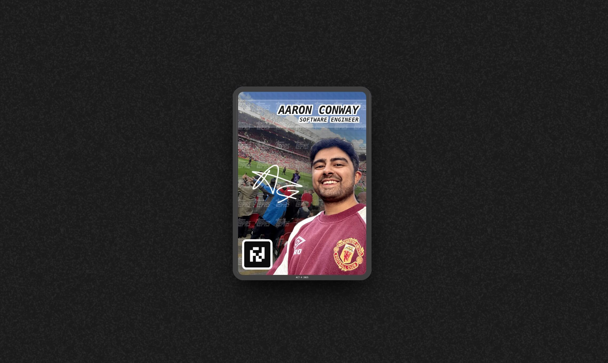

# My Website 7️⃣

🔗 **Live Site**: [aaronconway.co.uk](https://aaronconway.co.uk)

## 🛠️ Tech Stack

- **[Astro](https://astro.build)** - Static site generator
- **[Tailwind CSS](https://tailwindcss.com)** - Utility-first CSS framework
- **[GSAP](https://greensock.com/gsap/)** - Animation library
- **[Bun](https://bun.sh)** - JavaScript runtime and package manager

## 🧞 Commands

All commands are run from the root of the project, from a terminal:

| Command       | Action                                       |
| :------------ | :------------------------------------------- |
| `bun install` | Installs dependencies                        |
| `bun dev`     | Starts local dev server at `localhost:4321`  |
| `bun build`   | Build your production site to `./dist/`      |
| `bun preview` | Preview your build locally, before deploying |

## 🙏 Credits

A big thanks to Jhey Tompkins who built the holograph card code [here](https://x.com/jh3yy/status/1949978087497638367) which inspired this version of my site.